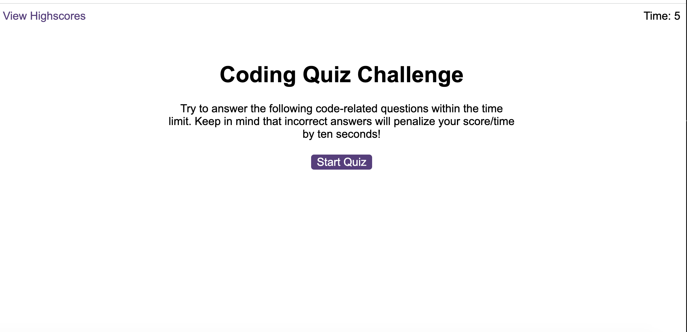

# Quiz-App

Quiz-App is an engaging web-based quiz platform built with HTML5, CSS3, and JavaScript. It features randomized questions, a countdown timer, real-time feedback, and a high-score tracker, providing fun and learning. The app stores high scores using localStorage and is fully accessible with keyboard navigation. Its responsive design ensures a seamless experience across devices. Perfect for testing your knowledge and competing with friends!

## Usage

To see the results, copy and paste this URL ("https://hoduola5.github.io/Quiz-App/") to Google, then click the button to start the quiz. Click the button of your best answer to each question, the app displays if the answer is correct or incorrect.  The game ends if all questions have been answered or the time counter reaches zero. When the quiz finishes, it displays high scores and asks the user to add their initials, then clears their initials and starts over.

## How to Contribute

I'm open to suggestions on how to make it better.
